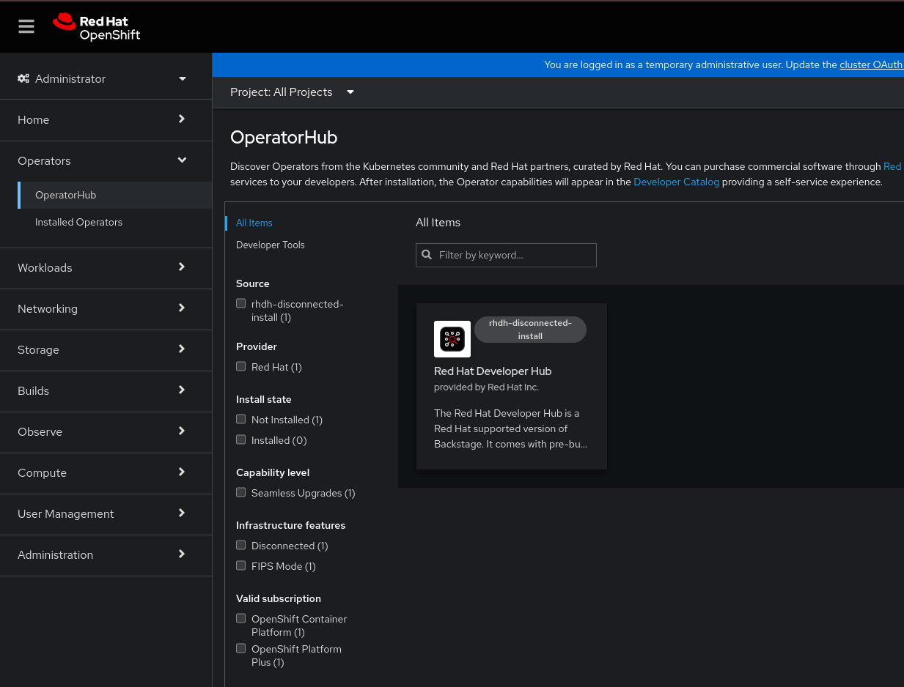
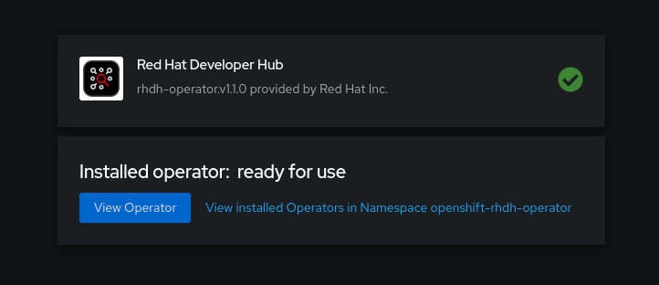

==== Installing Red Hat Developer Hub (RHDH) in restricted environments

On an OpenShift cluster operating in a restricted network, public resources are not available.
However, deploying the RHDH Operator and running RHDH requires the following public resources:

* Operator images (bundle, operator, catalog)
* Operands images (RHDH, PostgreSQL)

To make these resources available, we will need to replace them with their copies in a mirror registry accessible by the OpenShift cluster.

We provide a helper script that mirrors all the necessary images and does the necessary plumbing to ensure those images will be used when installing the RHDH Operator and creating RHDH instances.

This requires a target mirror registry, which you should already have if your OpenShift cluster is already ready to operate on a restricted network.

However, if you are preparing your cluster for disconnected usage, the script can also deploy a mirror registry in the cluster and use it for the mirroring process.

*Prerequisites*

* An active `oc` session with administrative permissions to the OpenShift cluster. See link:https://docs.openshift.com/container-platform/4.14/cli_reference/openshift_cli/getting-started-cli.html[Getting started with the OpenShift CLI].
* An active `oc registry` session to the `registry.redhat.io` Red Hat Ecosystem Catalog. See link:https://access.redhat.com/RegistryAuthentication[Red Hat Container Registry Authentication].
* `opm`. See link:https://docs.openshift.com/container-platform/4.14/cli_reference/opm/cli-opm-install.html[Installing the opm CLI].
* `jq`. See link:https://jqlang.github.io/jq/download/[Download jq].
* `podman`. See link:https://podman.io/docs/installation[Podman Installation Instructions].
* `skopeo` version 1.14 or higher. See link:https://github.com/containers/skopeo/blob/main/install.md[Installing Skopeo].
* If you already have a mirror registry for your cluster, an active `skopeo` session with administrative access to this registry is required. See link:https://github.com/containers/skopeo#authenticating-to-a-registry[Authenticating to a registry] and link:https://docs.openshift.com/container-platform/4.14/installing/disconnected_install/installing-mirroring-installation-images.html[Mirroring images for a disconnected installation].
+
NOTE: The internal OpenShift cluster image registry cannot be used as target mirror registry. See link:https://docs.openshift.com/container-platform/4.14/installing/disconnected_install/installing-mirroring-installation-images.html#installation-about-mirror-registry_installing-mirroring-installation-images[About the mirror registry].
* If you prefer to create your own mirror registry, refer to link:https://docs.openshift.com/container-platform/4.14/installing/disconnected_install/installing-mirroring-creating-registry.html[Creating a mirror registry with mirror registry for Red Hat OpenShift].
* If you don't already have a mirror registry and want the helper script to create one for you:
** `curl`. On Red Hat Enterprise Linux, this is available by installing the `curl` package; for other platforms, see link:https://curl.se/[the cURL website].
+
[source,console]
----
$ sudo yum install curl
----
** `htpasswd` from your package manager. On Red Hat Enterprise Linux, this is available by installing the `httpd-tools` package:
+
[source,console]
----
$ sudo yum install httpd-tools
----

**Procedure**

. Download and execute the mirroring script to install a custom Operator catalog and mirror the related images: `prepare-restricted-environment.sh` (link:https://github.com/janus-idp/operator/blob/main/.rhdh/scripts/prepare-restricted-environment.sh[source])
+
[source,console]
----
$ #
$ # For GA releases
$ #

$ # if you don't already have a target mirror registry
$ # and want the script to create one for you.
$ bash prepare-restricted-environment.sh \
   --prod_operator_index "registry.redhat.io/redhat/redhat-operator-index:v4.14" \
   --prod_operator_package_name "rhdh" \
   --prod_operator_bundle_name "rhdh-operator" \
   --prod_operator_version "v1.1.0"

$ # or, if you already have a target mirror registry
$ bash prepare-restricted-environment.sh \
   --prod_operator_index "registry.redhat.io/redhat/redhat-operator-index:v4.14" \
   --prod_operator_package_name "rhdh" \
   --prod_operator_bundle_name "rhdh-operator" \
   --prod_operator_version "v1.1.0" \
   --use_existing_mirror_registry "<my_registry>"

$ #----------------------------------------------------

$ #
$ # For CI Builds
$ #

$ # if you don't already have a target mirror registry
$ # and want the script to create one for you.
$ bash prepare-restricted-environment.sh \
   --prod_operator_index "quay.io/rhdh/iib:latest-v4.14-x86_64" \
   --prod_operator_package_name "rhdh" \
   --prod_operator_bundle_name "rhdh-operator" \
   --prod_operator_version "v1.1.0"

$ # or, if you already have a target mirror registry
$ bash prepare-restricted-environment.sh \
   --prod_operator_index "quay.io/rhdh/iib:latest-v4.14-x86_64" \
   --prod_operator_package_name "rhdh" \
   --prod_operator_bundle_name "rhdh-operator" \
   --prod_operator_version "v1.1.0" \
   --use_existing_mirror_registry "<my_registry>"
----
+
Be patient, the script can take several minutes to complete.
Once done, you can make sure your cluster is disconnected from the public internet and install the RHDH operator.
. Log in as an _administrator_ to the OpenShift web console.
. In the *Administrator* view of the OpenShift web console, go to *Operators* → *OperatorHub* and search for *Red Hat Developer Hub*.
+

. Install the Red Hat Developer Hub Operator. For more info, see https://docs.openshift.com/container-platform/4.14/operators/admin/olm-adding-operators-to-cluster.html#olm-installing-from-operatorhub-using-web-console_olm-adding-operators-to-a-cluster[Installing from OperatorHub using the web console].
+

. Create an OpenShift project to be used by your Backstage instance.
For more information about creating a project in OpenShift, see the https://docs.openshift.com/container-platform/4.14/applications/projects/working-with-projects.html#creating-a-project-using-the-web-console_projects[Red Hat OpenShift documentation].
. Switch to the *Developer* perspective in your Red Hat OpenShift web console.
. Click *+Add*.
. From the *Developer Catalog* panel, click *Operator Backed*.
. Search for _Backstage_ in the search bar and select the *Backstage* card.
. Click *Create*.
. Click *Create* and wait for the database and Red Hat Developer Hub to start.
. Click the *Open URL* option to start using the Red Hat Developer Hub platform.
+
image::images/rhdh_from_operator.png[RHDH from Operator]
. See link:openshift.adoc#_configurations_for_operator_backed_rhdh[Configurations for Operator-backed RHDH] for further details about configuring your RHDH instance.
