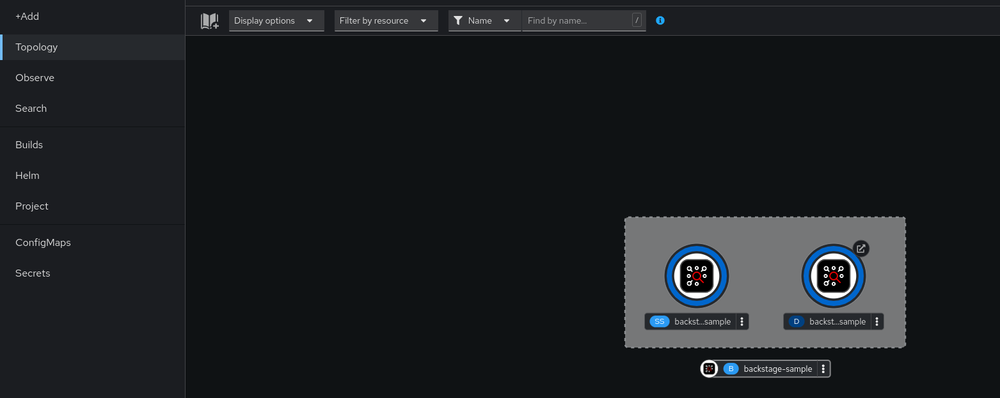
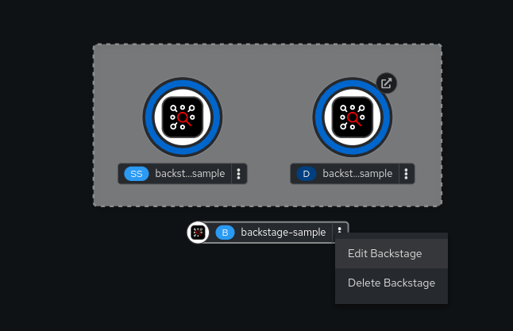
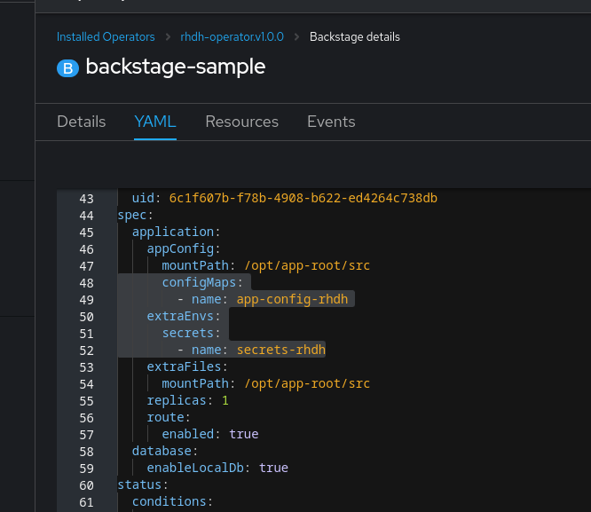
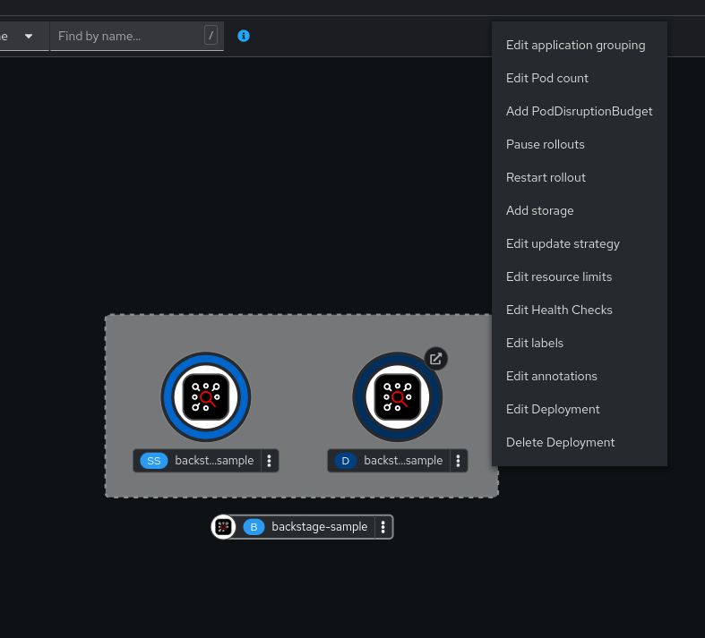
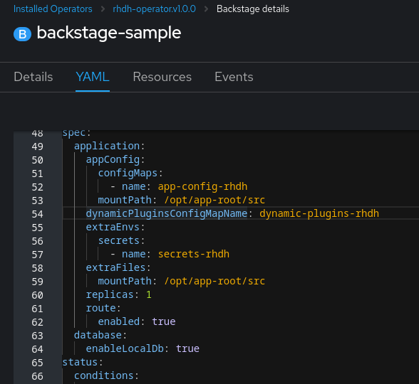
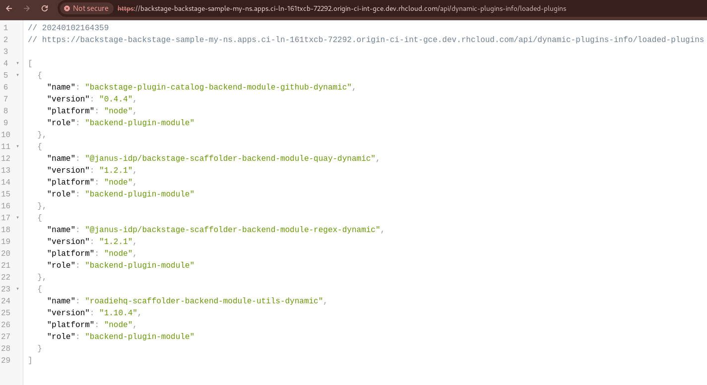
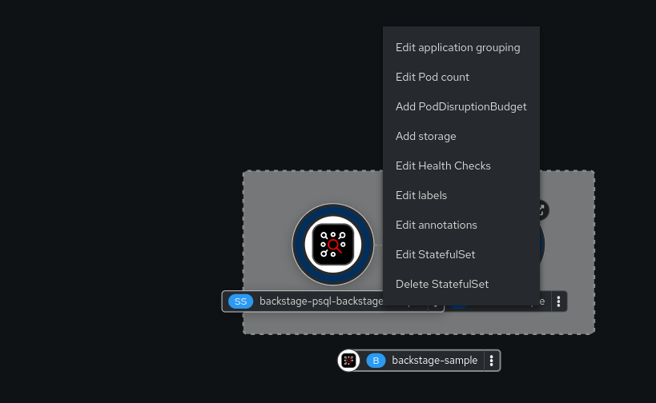
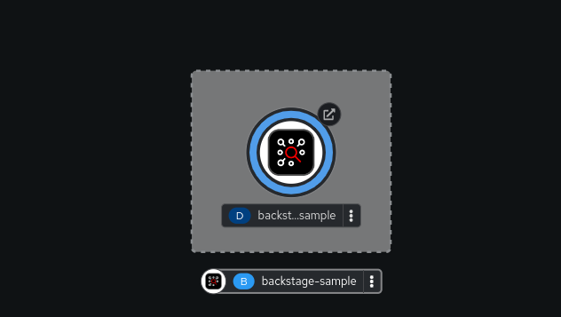

## Using the Operator to manage Red Hat Developer Hub (RHDH)

### Installing RHDH using Operator

**Prerequisites**

- You are logged in using the OpenShift web console.
- You have configured the appropriate roles and permissions within your project to create an application.
- You (or an administrator) have added the RHDH Operator Catalog Source. See https://gitlab.cee.redhat.com/rhidp/rhdh/-/blob/rhdh-1-rhel-9/docs/RHDH.adoc#user-content-operator-installation for more details. This is required until the Operator is fully available on the OpenShift Operator Hub.

**Procedure**

1. Create a project in the OpenShift, if not present.
   For more information about creating a project in OpenShift, see the [Red Hat OpenShift documentation](https://docs.openshift.com/container-platform/4.14/applications/projects/working-with-projects.html#creating-a-project-using-the-web-console_projects).
2. Switch to **Developer** mode on your Red Hat OpenShift web console.
3. Click **+Add**.
4. From the **Developer Catalog** panel, click **Operator Backed**.
5. Search for _Backstage_ in the search bar and select the **Backstage** card.
6. Click **Create**.
7. Click **Create** and wait for the database and Red Hat Developer Hub to start.
8. Click the **Open URL** option to start using the Red Hat Developer Hub platform.



### Configurations for Operator-backed RHDH

#### Adding a custom application configuration file to OpenShift

To access the Red Hat Developer Hub, you must add a custom application configuration file to OpenShift.
In OpenShift, you can use the following content as a base template to create a ConfigMap named `app-config-rhdh`:

```yaml
kind: ConfigMap
apiVersion: v1
metadata:
  name: app-config-rhdh
data:
  "app-config-rhdh.yaml": |
     app:
       baseUrl: https://backstage-<CUSTOM_RESOURCE_NAME>-<NAMESPACE_NAME>.<OPENSHIFT_CLUSTER_ROUTE_HOST>
       title: Red Hat Developer Hub
     backend:
       auth:
         keys:
           - secret: "${BACKEND_SECRET}"
       baseUrl: https://backstage-<CUSTOM_RESOURCE_NAME>-<NAMESPACE_NAME>.<OPENSHIFT_CLUSTER_ROUTE_HOST>
       cors:
         origin: https://backstage-<CUSTOM_RESOURCE_NAME>-<NAMESPACE_NAME>.<OPENSHIFT_CLUSTER_ROUTE_HOST>
```

<details>
<summary>Example</summary>

```yaml
kind: ConfigMap
apiVersion: v1
metadata:
  name: app-config-rhdh
data:
  "app-config-rhdh.yaml": |
    app:
      title: Red Hat Developer Hub
      baseUrl: https://backstage-backstage-sample-my-ns.apps.ci-ln-vtkzr22-72292.origin-ci-int-gce.dev.rhcloud.com
    backend:
      auth:
        keys:
          - secret: "${BACKEND_SECRET}"
      baseUrl: https://backstage-backstage-sample-my-ns.apps.ci-ln-vtkzr22-72292.origin-ci-int-gce.dev.rhcloud.com
      cors:
        origin: https://backstage-backstage-sample-my-ns.apps.ci-ln-vtkzr22-72292.origin-ci-int-gce.dev.rhcloud.com
```

</details>

**Notes**:
- There is a mandatory Backend Auth Key for Backstage. This will reference an environment variable backed by an OpenShift Secret.
- You need to know the external URL of your Backstage instance and set it in the `app.baseUrl`, `backend.baseUrl` and `backend.cors.origin` fields of the application configuration.
  By default, this will be named as follows: `https://backstage-<CUSTOM_RESOURCE_NAME>-<NAMESPACE_NAME>.<OPENSHIFT_CLUSTER_ROUTE_HOST>`,
  but if you are using a different host or sub-domain (customizable in the Custom Resource `spec.application.route` field), you will need to adjust the app configuration accordingly.

**Procedure**

1. Navigate to OpenShift and select the **ConfigMaps** tab.
2. Click **Create ConfigMap**.
3. Select the **YAML view** option in **Configure via** and make the changes to the file, if needed.
4. Click **Create**.
5. Select the **Secrets** tab.
6. Click **Create** then **Key/value** secret.
7. Name the Secret `secrets-rhdh`.
8. Add a key named `BACKEND_SECRET` and add any random string as value. It is recommended to use a unique value per RHDH Instance.
9. Click **Create**.
10. Go to the **Topology** view.
11. Click on the three dots of your Backstage instance and select **Edit Backstage**.

12. This will load the YAML view of the Backstage Instance. 
   Add the `spec.application.appConfig.configMaps` and `spec.application.extraEnvs.secrets` fields to the Custom Resource, like so:
    ```yaml
    spec:
      application:
        appConfig:
          mountPath: /opt/app-root/src
          configMaps:
             - name: app-config-rhdh
        extraEnvs:
          secrets:
             - name: secrets-rhdh
        extraFiles:
          mountPath: /opt-/app-root/src
        replicas: 1
        route:
          enabled: true
      database:
        enableLocalDb: true
    ```
    
13. Click **Save**.
14. Navigate back to the **Topology** view and delete the Backstage Deployment, so that the Operator can recreate it with the new changes to the CR.
    Note that this is a manual step at this time, but the operator will soon be able to handle such changes automatically.

15. Wait for the Red Hat Developer Hub Pod to start.
16. Click the **Open URL** option to start using the Red Hat Developer Hub platform with the new configuration changes.

#### Configuring Dynamic Plugins with the Operator

Configuration for Dynamic Plugins can be stored in any ConfigMap object, which can then be referenced into the Custom Resource.
Example with the Dynamic Plugin for GitHub:
In OpenShift, you can use the following content as a base template to create a ConfigMap named `dynamic-plugins-rhdh`:
```yaml
kind: ConfigMap
apiVersion: v1
metadata:
  name: dynamic-plugins-rhdh
data:
  "dynamic-plugins.yaml": |
    includes:
      - dynamic-plugins.default.yaml
    plugins:
      - package: './dynamic-plugins/dist/backstage-plugin-catalog-backend-module-github-dynamic'
        disabled: false
        pluginConfig: {}
```

NOTE: If the `pluginConfig` field references environment variables, they will need to be provided by editing your `secrets-rhdh` Secret accordingly.

**Procedure**

1. Navigate to OpenShift and select the **ConfigMaps** tab.
2. Click **Create ConfigMap**.
3. Select the **YAML view** option in Configure via and make the changes to the file, if needed.
4. Click **Create**.
5. Go to the **Topology** Tab.
6. Click on the three dots of your Backstage instance and select **Edit Backstage**.

7. This will load the YAML view of the Backstage Instance. Add the `spec.application.dynamicPluginsConfigMapName` field to the Custom Resource, like so:
```yaml
spec:
  application:
    appConfig:
      mountPath: /opt/app-root/src
      configMaps:
         - name: app-config-rhdh
    dynamicPluginsConfigMapName: dynamic-plugins-rhdh
    extraEnvs:
      secrets:
         - name: secrets-rhdh
    extraFiles:
      mountPath: /opt-/app-root/src
    replicas: 1
    route:
      enabled: true
  database:
    enableLocalDb: true
```

8. Click **Save**. 
9. Navigate back to the **Topology** View and delete the Backstage Deployment, so that the Operator can recreate it with the new changes to the CR.
   Note that this is a manual step at this time, but the operator will soon be able to handle such changes automatically.
10. Wait for the Red Hat Developer Hub Pod to start.
11. Click the **Open URL** option to start using the Red Hat Developer Hub platform with the new configuration changes.

**Verification**

To check that the dynamic plugins configuration has been loaded, append the following to your Red Hat Developer Hub root URL: `/api/dynamic-plugins-info/loaded-plugins` and check the list of plugins:



#### Using an external Database

By default, the Custom Resource (CR) is set to deploy a local PostgreSQL database, but this behavior can be disabled in the CR.
To do so, you need to:
- set the `spec.database.enableLocalDb` field to false;
- and fill the `spec.database.authSecretName` field referencing a Secret containing the external DB connection information.

The external DB Secret is expected to have the following keys defined in it:
- `POSTGRES_HOST`
- `POSTGRES_PORT`
- `POSTGRES_USER`
- `POSTGRES_PASSWORD`

**Procedure**

1. Select the **Secrets** tab.
2. Click **Create** then **Key/value** secret.
3. Name the Secret `secrets-db-rhdh`.
4. Add all the `POSTGRES_*` keys from the list above, along with their values.
5. Click **Create**.
6. Go to the **Topology** view.
7. Click on the three dots of your Backstage instance and select **Edit Backstage**.
   
8. This will load the YAML view of the Backstage Instance.
   Set the `spec.database.enableLocalDb` field to false and fill the `spec.database.authSecretName` field, like so
   ```yaml
   spec:
     application:
       appConfig:
         mountPath: /opt/app-root/src
         configMaps:
            - name: app-config-rhdh
       dynamicPluginsConfigMapName: dynamic-plugins-rhdh
       extraEnvs:
         secrets:
            - name: secrets-rhdh
       extraFiles:
         mountPath: /opt-/app-root/src
       replicas: 1
       route:
         enabled: true
     database:
       enableLocalDb: false
       authSecretName: secrets-db-rhdh
   ```
9. Click **Save**.
10. Navigate back to the **Topology** view and delete both the Backstage Deployment and PostgreSQL StatefulSet, so that the Operator can recreate it with the new changes to the CR.
    Note that this is a manual step at this time, but the operator will soon be able to handle such changes automatically.
    
    
11. Wait for the Red Hat Developer Hub Pod to start. The Database resource should not be created.
    
12. Click the **Open URL** option to start using the Red Hat Developer Hub platform with the new configuration changes.

**Note**

If your RHDH pod is stuck in a `CrashLoopBackOff` and you see the following logs:
```
Loaded config from app-config-from-configmap.yaml, env
...
Backend failed to start up Error: Failed to connect to the database to make sure that 'backstage_plugin_auth' exists
```
Then, first, verify the connection information to the external database and make sure the external database is configured accordingly.
This is because the credentials might not be valid or the external database might not be configured to accept connections from this instance.


#### Air-gap/Offline support

TODO
