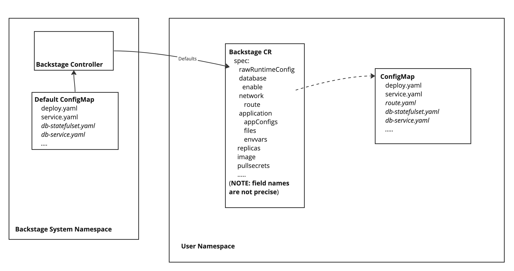

# Administrator Guide

## Backstage Operator configuration

### Context

As it is described in Design doc (TODO), Backstage CR's desired state is defined using layered configuration approach, which means:
- By default each newly created Backstage CR uses Operator scope Default Configuration
- Which can be fully or partially overriden for particular CR instance using ConfigMap with the name pointed in BackstageCR.spec.RawConfig 
- Which in turn can be customized by other BackstageCR.spec fields (see Backstage API doc)

Cluster Administrator may want to customize Default Configuration due to internal preferences/limitations, for example:
- Preferences/restrictions for Backstage and|or PostgreSQL images due to  Airgapped environment.
- Existed Taints and Tolerations policy, so Backstage Pods have to be configured with certain tolerations restrictions.
- ...

Default Configuration is implemented as a ConfigMap called *backstage-default-config*, deployed on *backstage-system* namespace and mounted to Backstage controller container as a */default-config* directory.
This config map contains the set of keys/values which maps to file names/contents in the */default-config*.
These files contain yaml manifests of objects used by Backstage controller as an initial desired state of Backstage CR according to Backstage Operator configuration model:

 

Mapping of configMap keys (yaml files) to runtime objects (NOTE: for the time (Dec 20'23) it is a subject of change):

| Key/File name                  | k8s/OCP Kind       | Mandatory*     | version | Notes                                           |
|--------------------------------|--------------------|----------------|---------|-------------------------------------------------|
| deployment.yaml                | appsv1.Deployment  | Yes            | all     | Backstage deployment                            |
| service.yaml                   | corev1.Service     | Yes            | all     | Backstage Service                               |
| db-statefulset.yaml            | appsv1.Statefulset | For DB enabled | all     | PostgreSQL StatefulSet                          |    
| db-service.yaml                | corev1.Service     | For DB enabled | all     | PostgreSQL Service                              |
| db-service-hl.yaml             | corev1.Service     | For DB enabled | all     | PostgreSQL Service                              |
| db-secret.yaml                 | corev1.Secret      | For DB enabled | all     | Secret to connect Backstage to PSQL             |
| route.yaml                     | openshift.Route    | No (for OCP)   | all     | Route exposing Backstage service                |
| app-config.yaml                | corev1.ConfigMap   | No             | 0.0.2   | Backstage app-config.yaml                       |
| configmap-files.yaml           | corev1.ConfigMap   | No             | 0.0.2   | Backstage config file inclusions from configMap |
| configmap-envs.yaml            | corev1.ConfigMap   | No             | 0.0.2   | Backstage env variables from configMap          |
| secret-files.yaml              | corev1.Secret      | No             | 0.0.2   | Backstage config file inclusions from Secret    |
| secret-envs.yaml               | corev1.Secret      | No             | 0.0.2   | Backstage env variables from Secret             |
| dynamic-plugins.yaml           | corev1.ConfigMap   | No             | 0.0.2   | dynamic-plugins config *                        |
| dynamic-plugins-configmap.yaml | corev1.ConfigMap   | No             | 0.0.1   | dynamic-plugins config *                        |
| backend-auth-configmap.yaml    | corev1.ConfigMap   | No             | 0.0.1   | backend auth config                             |

NOTES: 
 - Mandatory means it is needed to be present in either (or both) Default and CR Raw Configuration.
 - dynamic-plugins.yaml is a fragment of app-config.yaml provided with RHDH/Janus-IDP, which is mounted into a dedicated initContainer. 
 - items marked as version 0.0.1 are not supported in version 0.0.2 
### Operator Bundle configuration 

With Backstage Operator's Makefile you can generate bundle descriptor using *make bundle* command

Along with CSV manifest it generates default-config ConfigMap manifest, which can be modified and applied to Backstage Operator.

[//]: # (TODO: document how an administrator can make changes to the default operator configuration, using their own configuration file (perhaps based on the generated one), and apply it using `kubectl` or `oc`.

### Kustomize deploy configuration

Make sure use the current context in your kubeconfig file is pointed to correct place, change necessary part of your config/manager/default-config or just replace some of the file(s) with yours and run
``
make deploy
``

### Direct ConfigMap configuration

You can change default configuration by directly changing the default-config ConfigMap with kubectl like:

 - retrieve the current `default-config` from the cluster

``
kubectl get -n backstage-system configmap default-config > my-config.yaml
``

- modify the file in your editor of choice

- apply the updated configuration to your cluster

``
  kubectl apply -n backstage-system -f my-config.yaml
``

It has to be re-applied to the controller's container after being reconciled by kubernetes processes.

### Use Cases

#### Airgapped environment

When creating the Backstage CR, the Operator will try to create a Backstage Pod, deploying:
- Backstage Container from the image, configured in *(deployment.yaml).spec.template.spec.Containers[].image*
- Init Container (applied for RHDH/Janus-IDP configuration, usually the same as Backstage Container)

Also, if Backstage CR configured with *EnabledLocalDb*,  it will create a PostgreSQL container pod, configured in *(db-deployment.yaml).spec.template.spec.Containers[].image*

By default, the Backstage Operator is configured to use publicly available images.
If you plan to deploy to a [restricted environment](https://docs.openshift.com/container-platform/4.14/operators/admin/olm-restricted-networks.html),
you will need to configure your cluster or network to allow these images to be pulled.
For the list of related images deployed by the Operator, see the `RELATED_IMAGE_*` env vars or `relatedImages` section of the [CSV](../bundle/manifests/backstage-operator.clusterserviceversion.yaml).
See also https://docs.openshift.com/container-platform/4.14/operators/admin/olm-restricted-networks.html