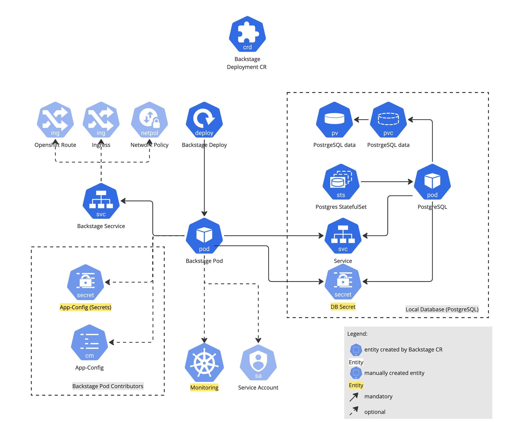
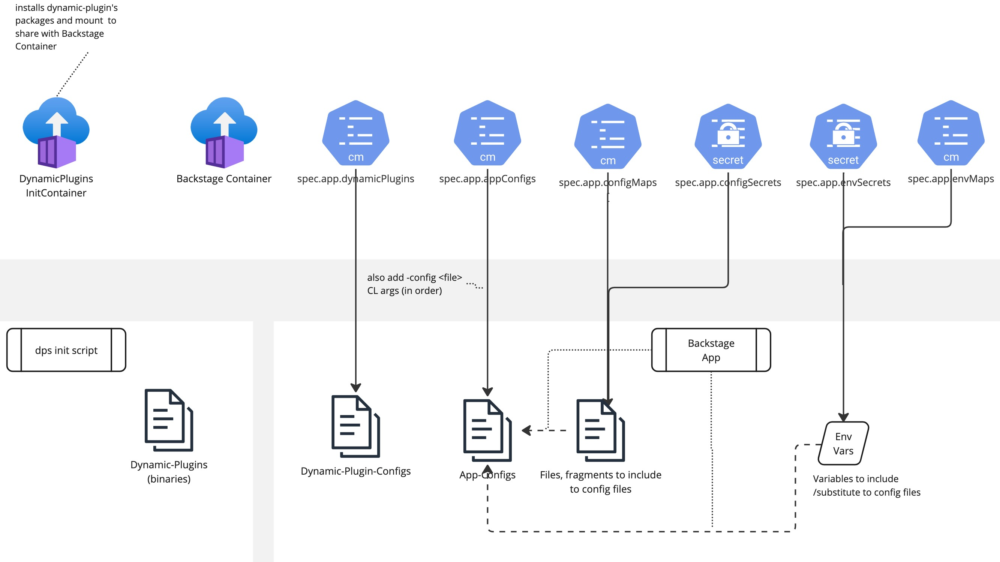

# Backstage Operator Design [WIP]

The goal of Backstage Operator is to deploy Backstage workload to the Kubernetes namespace and keep this workload synced with the desired state defined by configuration. 

## Backstage Kubernetes Runtime

Backstage Kubernetes workload consists of set of Kubernetes resources (Runtime Objects).
Approximate set of Runtime Objects necessary for Backstage server on Kubernetes is shown on the diagram below:

The most important object is Backstage Pod created by Backstage Deployment. That is where we run 'backstage-backend' container with Backstage application inside.
This Backstage application is a web server which can be reached using Backstage Service.
Actually, those 2 are the core part of Backstage workload. 

Backstage application uses SQL database as a data storage and it is possible to install PostgreSQL DB on the same namespace as Backstage instance.
It brings PostgreSQL StatefulSet/Pod, Service to connect to Backstage and PV/PVC to store the data.

For providing external access to Backstage server it is possible, depending on underlying infrastructure, to use Openshift Route or
K8s Ingress on top of Backstage Service.
Note that in versions up to 0.0.2, only Route configuration is supported by the Operator.

Finally, the Backstage Operator supports all the [Backstage configuration](https://backstage.io/docs/conf/writing) options, which can be provided by creating dedicated 
ConfigMaps and Secrets, then contributing them to the Backstage Pod as mounted volumes or environment variables (see [Configuration](configuration.md) guide for details).  

## Configuration

### Configuration layers

The Backstage Operator can be configured to customize the deployed workload.
With no changes to the default configuration, an admin user can deploy a Backstage instance to try it out for a local, personal, or small group test deployment.

When you do want to customize your Backstage instance, there are 3 layers of configuration available.

As shown in the picture above:

- There is an Operator (Cluster) level Default Configuration implemented as a ConfigMap inside Backstage system namespace
  (where Backstage controller is launched). It allows to choose some optimal for most cases configuration which will be applied 
if there are no other config to override (i.e. Backstage CR is empty). 
- Another layer overriding default is instance (Backstage CR) scoped, implemented as a ConfigMap which
has the same as default structure but inside Backstage instance's namespace. The name of theis ConfigMap 
is specified on Backstage.Spec.RawConfig field. It offers very flexible way to configure certain Backstage instance  
- And finally, there are set of fields on Backstage.Spec to override configuration made on level 1 and 2.
It offers simple configuration of some parameters. So, user is not required to understand the
overall structure of Backstage runtime object and is able to simply configure "the most important" parameters.
  (see [configuration](configuration.md) for more details)

### Backstage Application

Backstage Application comes with advanced configuration features.

As per the [Backstage configuration](https://backstage.io/docs/conf/writing), a user can define and overload multiple _app-config.yaml_
files and flexibly configure them by including environment variables.
Backstage Operator supports this flexibility allowing to define these configurations components in all the configuration levels
(default, raw and CR)

### Networking
TODO
